# BritCommerce-Ltd.-Company-Overview

# Project Background
BritCommerce Ltd. is a fictional e-commerce marketplace company based in London, United Kingdom, serving as a comprehensive platform for diverse consumer needs. Between January 2022 and December 2024, the company recorded 98,723 orders from 43,199 unique customers, featuring 30,000 distinct products organized across 15 different product lines with global reach but strongest market presence in the UK. The platform accommodates diverse customer preferences through multiple payment methods including credit cards, debit cards, PayPal, mobile payments, cryptocurrency, and cash on delivery. This dataset contains comprehensive commercial data including customer demographics (age, gender, location, and segments), product specifications (costs, pricing, and profit margins), and detailed transaction information, enabling sophisticated CRM analysis and strategic marketing insights. The analysis examines BritCommerce's three-year performance trajectory to provide critical insights into operational efficiency, market positioning, and growth patterns that will contribute to the company's continued development in the competitive e-commerce landscape.

The report provides evaluations and guidance on the following major topics:

- 📊 **Sales Trends Analysis**: An evaluation of historical sales patterns, focusing on annual revenue progression, monthly revenue breakdowns, month-over-month growth fluctuations, and geographic revenue distribution across global markets.
- 📦 **Product Performance**: An analysis of BritCommerce's 15 distinct product lines, understanding their contribution to overall revenue, profitability, and market positioning within the diverse product portfolio.
- 👥 **Customer Demographics and Segmentation**: A detailed breakdown of customer age categories, gender distribution, and geographic presence in relation to revenue generation, along with segmentation based on spending behavior to identify high-value customer groups.
- 💳 **Payment Method Analysis**: An evaluation of transaction preferences across different payment types including traditional and digital methods, analyzing their impact on order volume, customer satisfaction, and operational efficiency.

# 🧩 Schema Description
The SQL code establishes a comprehensive database system for BritCommerceLtd with three interconnected tables, implementing advanced customer segmentation through CTEs and automated profit calculations. The implementation includes robust data validation protocols and enriches the dataset with analytical dimensions such as customer segments, age categories, and profitability metrics to enable sophisticated business intelligence and marketing analytics.

You can access the SQL codes used to accomplish all this [here](BritCommerceLtd.sql).

BritCommerce's database follows a classic e-commerce structure with three core tables: products (storing product details, costs, and pricing), customers (containing demographic and segmentation data), and sales (capturing transaction records). The sales table serves as the central hub, linking products and customers through foreign key relationships while storing essential transaction data including quantities, payments, and calculated profits.

# Executive Summary
The BritCommerce Ltd. has achieved substantial scale with 98,723 total orders generating $221.59M in revenue across 43,199 customers, maintaining a healthy 22.85% profit margin. Revenue growth tells a story of rapid expansion followed by contraction, with strong year-over-year growth of 17.67% in 2023 as revenue increased from $68M to $80M, but experiencing a significant decline of -8.55% in 2024 with revenue dropping to $73M. The company maintains consistent monthly performance with revenues stabilizing around $20M per month, while the average order value of $2.24K indicates a premium market positioning. Despite the recent revenue decline, the business demonstrates operational resilience with diversified payment methods and global geographic reach.

You can download the full interactive dashboard [here](BritCommerceLtd_dashboard.pbix).

# Sales Trends

## Annual Revenue and Profit 

The Annual Revenue and Profit chart shows BritCommerce Ltd.'s financial performance over three years, with total revenue growing from $68M in 2022 to $80M in 2023 (an 18% increase), then declining to $73M in 2024 (a 9% drop). Profit margins remained relatively stable across the period, with profits of $16M in 2022, $18M in 2023, and $17M in 2024, maintaining consistent profitability ratios around 23-24%. The 2023 peak represents the company's strongest performance year, generating $98M in combined revenue and profit, but the 2024 contraction suggests emerging challenges that interrupted the growth trajectory. This revenue decline, despite maintaining healthy profit margins, indicates potential market pressures or competitive challenges that require strategic intervention to restore growth momentum.

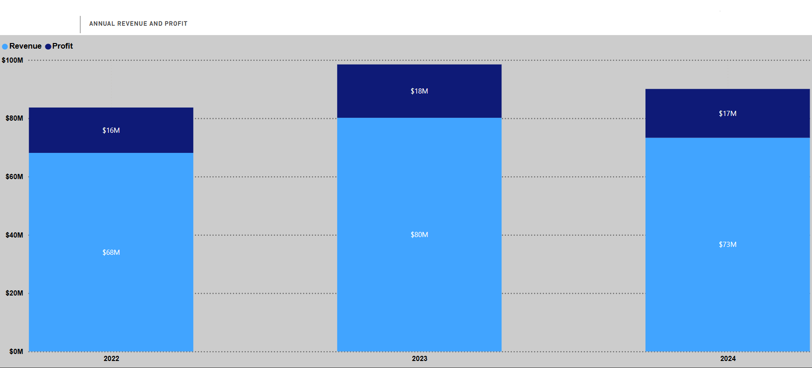

## Revenue by Year and Month 

BritCommerce experiencing distinct seasonal patterns with peak performance in May and December 2023, reaching approximately $8.5M, while experiencing a notable summer decline with July 2023 hitting a low point around $5.5M. The company recovered strongly by December 2023, but faced a sharp downturn in early 2024 with January and February showing significant drops to around $5.2M. Throughout 2024, the revenue pattern shows continued volatility with peaks in August and December reaching $7M-$7.5M, but experiencing troughs in February and September at approximately $5.3M. This pattern suggests BritCommerce's business is influenced by specific seasonal factors that differ from traditional retail cycles, with summer months being particularly challenging and strong performance occurring during spring (May) and winter holiday periods (December), indicating the need for targeted strategies during these predictable low-demand periods.

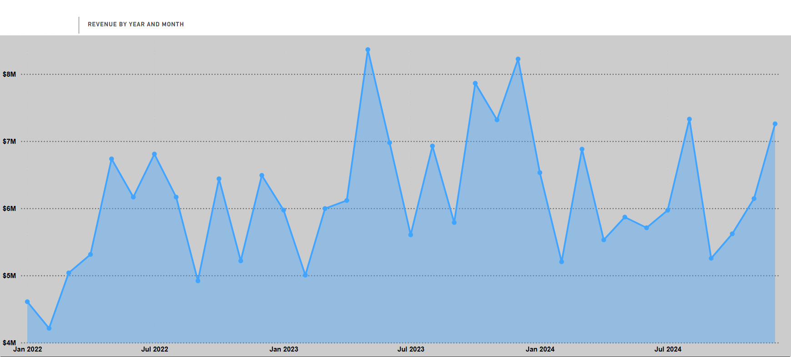

## Revenue vs. Monthly Moving Averages by Date 

The Revenue vs. Monthly Moving Averages chart reveals different peak timings across the moving average periods, indicating delayed momentum effects in BritCommerce's revenue trends. The 3-month moving average (blue line) reaches its peak at the end of 2023/beginning of 2024, showing the most immediate response to the strong late-2023 performance. The 6-month moving average (orange line) peaks later in the first quarter of 2024 and again around the fourth month (April), which falls in the second quarter of 2024, reflecting a more gradual incorporation of the revenue gains. Most notably, the 12-month moving average (purple line) doesn't reach its peak until around the fourth month (April) of 2024, which is in the second quarter, demonstrating how longer-term trends can mask short-term volatility and show sustained momentum even as recent performance declines. This staggered peak pattern suggests that while BritCommerce experienced its strongest operational performance in late 2023, the beneficial effects continued to influence longer-term averages well into the second quarter of 2024. The daily revenue spikes (light blue bars) continue to show significant volatility throughout the period, but the moving averages provide clear evidence of how different time horizons reveal varying perspectives on the company's performance trajectory.

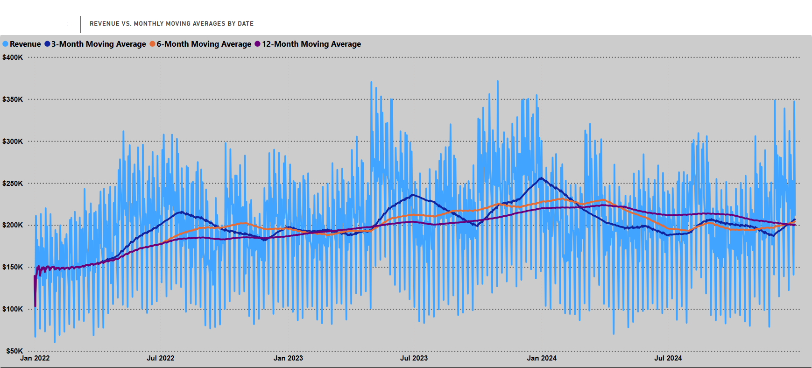

## Monthly Revenue vs. Profit Breakdown 

This stacked bar chart reveals BritCommerce's seasonal performance patterns across 2022-2024, with May ($26.8M total) and December ($27.0M total) emerging as peak revenue months, while February shows the weakest performance at $17.7M total. The company maintains consistent profit margins of 18-23% throughout the year, demonstrating stable operational efficiency despite seasonal revenue fluctuations. The strong performance in May and December likely corresponds to key shopping seasons and promotional campaigns that drive both revenue growth and sustained profitability.

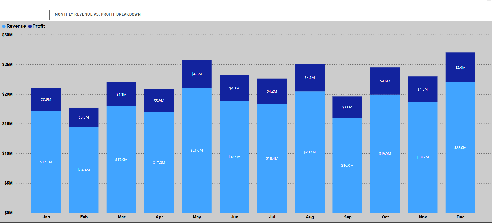

## Order Volume by Weekday 

The weekday order distribution across 2022-2024 shows Monday as BritCommerce's peak ordering day with approximately 19,000 total orders, followed by Wednesday at around 17,500 orders, indicating strong start-of-week momentum and mid-week customer engagement. Sunday represents the lowest order volume at roughly 7,500 orders, demonstrating typical consumer behavior where weekend shopping activity is minimal compared to weekdays. The relatively consistent order volumes from Tuesday through Friday (13,000-15,000 orders each) suggest stable business-day purchasing patterns, with a notable drop-off on Saturday (12,000 orders) as the weekend begins.

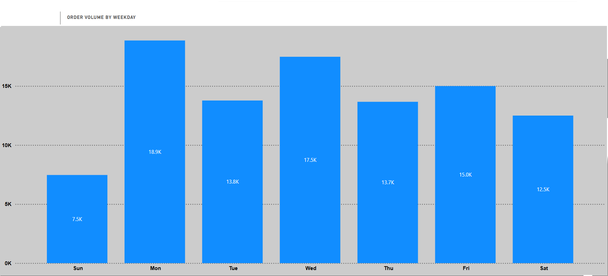

## Month-over-Month (%) Growth in Revenue 

This chart displays BritCommerce's average monthly growth patterns across 2022-2024, revealing distinct seasonal trends in revenue momentum. The company experiences its strongest growth periods in March (25%), May (23%), and October (25%), indicating robust performance during spring months and the crucial fourth-quarter period leading into holiday sales. Conversely, BritCommerce faces consistent challenges in January (-15%), February (-16%), and September (-22%), with September showing the most severe contraction, likely reflecting post-summer market conditions and pre-holiday consumer spending patterns. The volatile nature of month-over-month growth, swinging from significant declines to substantial gains, suggests BritCommerce's revenue is highly sensitive to seasonal factors and consumer behavior cycles.

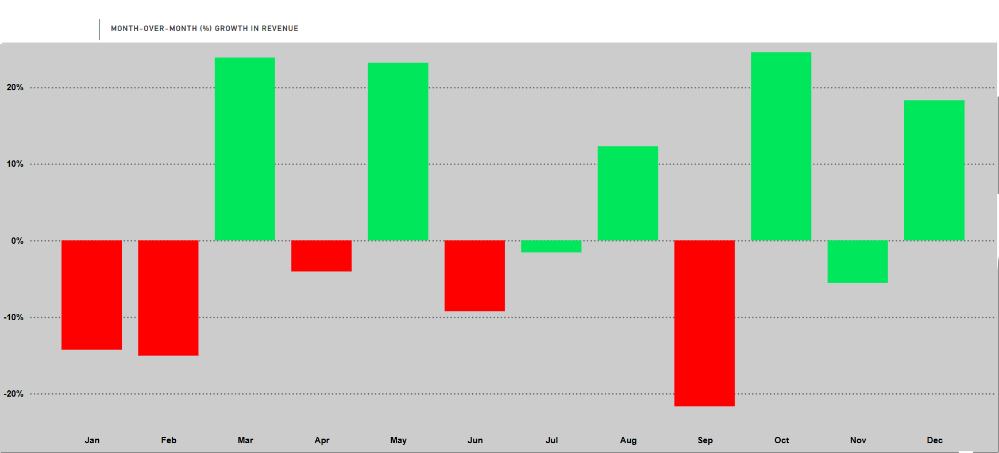

## City-Level Map of Revenue

BritCommerce Ltd shows strong European market penetration with clear geographic concentration around major economic hubs like London, Paris, Berlin, and Rome. The company demonstrates particularly robust performance in Northern and Western European markets (UK, Germany, France, Benelux), while maintaining meaningful but smaller revenue streams from Southern and Eastern European cities. This distribution reflects a well-diversified European customer base with expected revenue disparities between major capitals and secondary metropolitan areas.

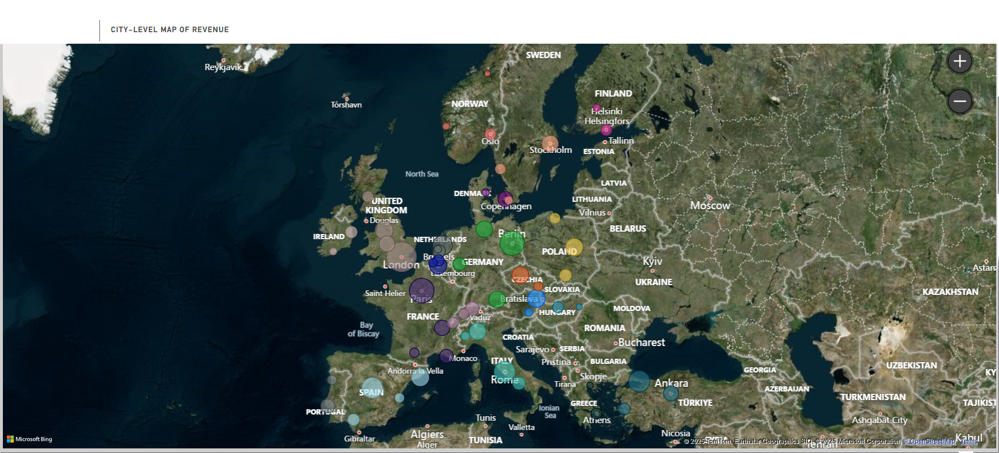

# Product Performance

Product_6028_WEWBO from the Automotive category leads BritCommerce in sales volume with 244 units sold and $16.38K revenue, but its 19.32% profit margin significantly underperforms the 29.58% company average. Despite being the top-selling product, its modest revenue pales compared to products generating over $100K, highlighting a concerning disconnect between sales volume and profitability performance.

## Revenue by Product Line

Toys and Home&Kitchen are the most dominant revenue generators, followed by Health&Fitness and Electronics. Despite the narrow profit margin range (Gaming at 23.55% highest, Sneakers at 22.28% lowest), the color variations highlight that high-revenue categories like Toys maintain relatively lower margins while smaller segments like Gaming achieve the best profitability rates across the portfolio.

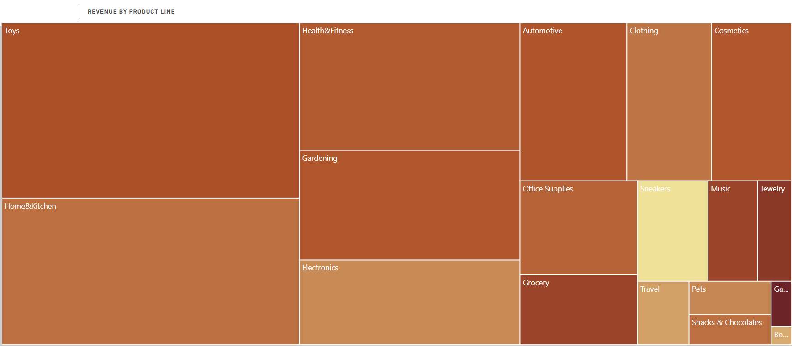

## Top 7 Revenue Generating Product Lines

BritCommerce's product portfolio shows Toys as the clear revenue leader at $46.1M total, followed by Home&Kitchen at $37.9M, but concerning revenue declines across all product lines in 2024 from 2023 peaks suggest market challenges or increased competition. Despite the diversified product mix spanning consumer discretionary categories to Electronics ($16.3M) and Clothing ($11.7M), the consistent downward trend in the most recent year indicates potential performance issues requiring strategic attention.

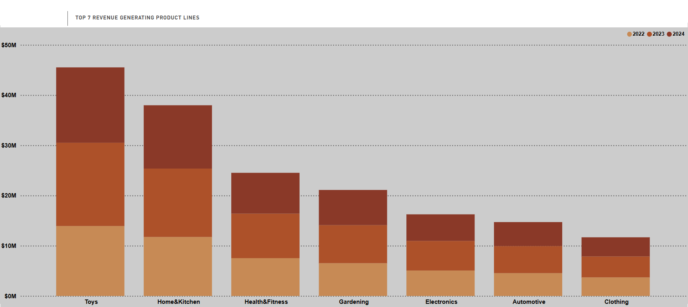

## Total Product Count and Average Profit Percentage by Product Line

BritCommerce's product portfolio shows Toys dominating with over 6,000 products at 29.6% profit margins, while smaller categories like Gaming, Books, and Snacks & Chocolates achieve the highest profit percentages (reaching 30.2%) despite lower volumes. This inverse relationship between product volume and profitability suggests BritCommerce could benefit from strategically expanding high-margin niche categories while optimizing their high-volume segments.

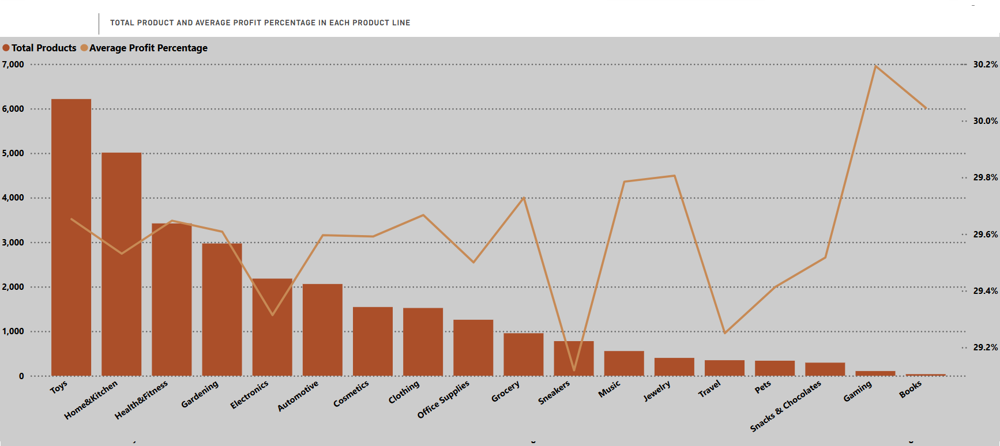

## Top 10 Best-Selling Products Analysis

The top-selling products reveal Electronics leading in profitability with Product_29262_CY8BO achieving a 19.7% profit margin ($25,186 profit on $127,510 revenue), while Home&Kitchen's Product_19574_EWCOS delivers the highest absolute profit of $30,477 with a 25.9% margin. Profit margins across the top products range from 16.2% to 25.9%, with Home&Kitchen and Electronics categories generally outperforming Toys and Automotive in profitability despite similar sales volumes. This data suggests BritCommerce's pricing strategy effectively balances competitiveness with profitability across their diverse product portfolio.

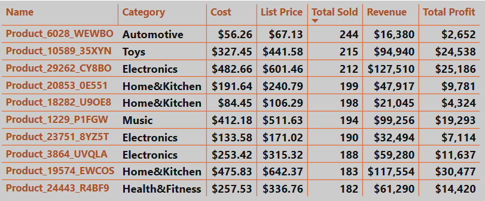

## Customer Segment vs Product Line Sales Heatmap

The heatmap shows that High Spenders significantly dominate sales, especially in Home & Kitchen and Toys, indicated by the darkest shades. Other segments like Loyal and Promising also contribute noticeably across categories, but at a lower intensity. Segments such as Newbies, Occasional Shoppers, and Value Seekers have minimal engagement across all product lines.

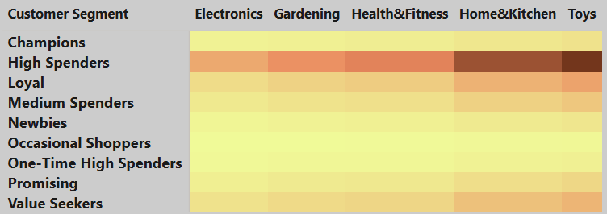

# Customer Demographics and Segmentation

## Number of Customers per Country

BritCommerce Ltd demonstrates strong home market dominance with the UK representing the largest customer base and highest revenue (darkest green), followed by Germany as the second key market. The company shows solid European diversification across major markets like France, Italy, and Spain, while the lighter shading on Nordic and Eastern European countries indicates potential for revenue growth in these smaller markets.

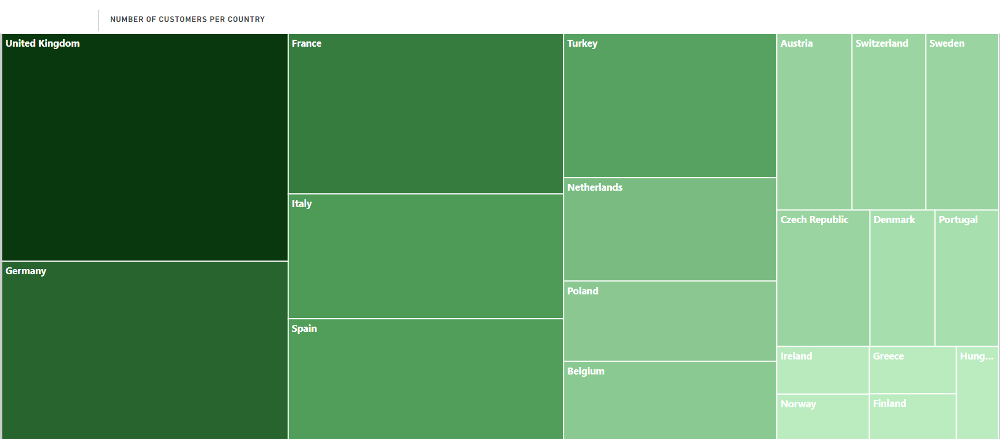

## Number of Customers per Age

BritCommerce Ltd's customer base shows a strong concentration in younger demographics, with the 26-35 age group representing the largest segment at 35.95% (15.53K customers), followed closely by 18-25 year-olds at 24.04% (10.38K customers). The company effectively captures nearly 60% of its customers from these two younger segments, while maintaining solid representation across middle-aged groups (36-45 and 46-55), suggesting successful appeal to digitally-native consumers with room to expand among older demographics.

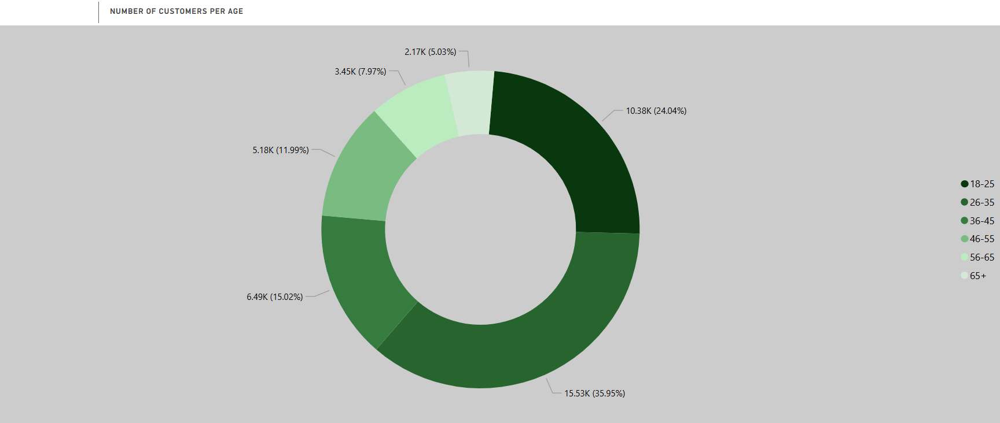

## Number of Customer per Segment

BritCommerce Ltd's customer segmentation reveals a healthy mix with Value Seekers forming the largest group at 25.7% (11.1K customers), followed closely by Loyal customers at 23.47% (10.14K) and High Spenders at 14.84% (6.41K). The company successfully maintains strong relationships with high-value segments while also capturing price-conscious consumers, though the relatively small Champions segment at just 1.52% suggests an opportunity to cultivate more top-tier customers who combine high spending with strong loyalty.

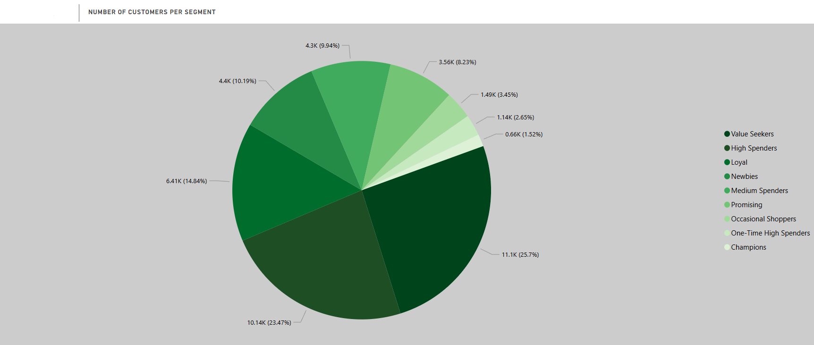

## Total Revenue per Customer Segment and Gender

High Spenders dominate BritCommerce Ltd's revenue generation at $97.42M, with female customers contributing significantly more than males across this top-performing segment. While Value Seekers represent the largest customer count, they generate considerably less revenue ($26.56M) compared to High Spenders, highlighting the critical importance of the premium customer segments for the company's financial performance. The gender distribution shows females consistently outspending males across most segments, suggesting targeted marketing toward female demographics could further optimize revenue growth.

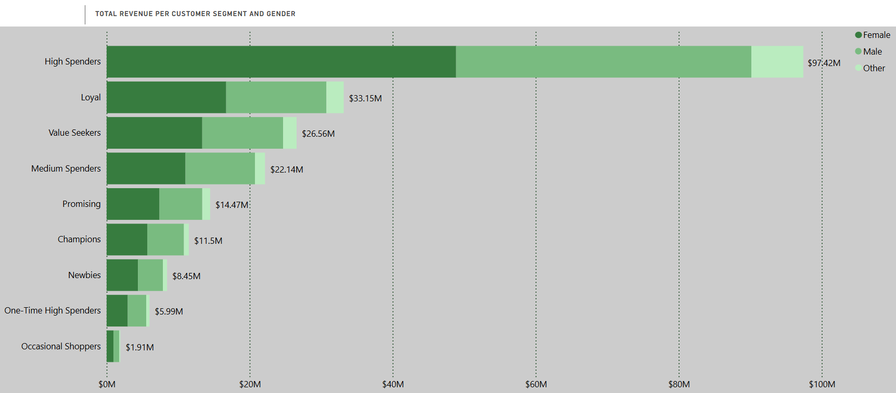

# Payment Method Analysis

## Payment Method Performance Analysis

BritCommerce's payment data shows credit card as the dominant method with 39,440 orders (39.9% of total) generating $88.5M in revenue and $20.2M profit, followed by debit card at 24,701 orders (25.0%) with $55.7M revenue and $12.7M profit. Cash on delivery, mobile payment, and PayPal each contribute roughly 10% of orders with revenues approximately about $22M, while cryptocurrency remains limited at 5,026 orders (5.1%) but still generates $11.3M in revenue. Despite varied payment preferences, average order values remain remarkably consistent across all methods ($2,221-$2,256), and profit margins appear relatively stable, indicating healthy profitability across all payment channels. This distribution highlights BritCommerce's successful multi-payment strategy while suggesting opportunities to further promote digital payment adoption among their customer base.

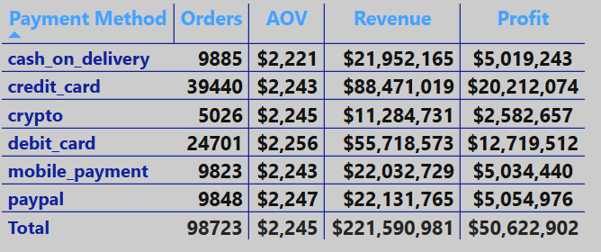

# Key Insights

## Financial Performance

**Revenue Trajectory Concerns:** BritCommerce achieved peak performance in 2023 with $80M revenue (+17.67% YoY), but experienced significant decline in 2024 to $73M (-8.55%), indicating potential market challenges or competitive pressures requiring immediate attention.

**Seasonal Revenue Volatility:** The company exhibits extreme seasonal fluctuations with May and December representing peak months ($26.8M-$27M) while February consistently underperforms ($17.7M), creating predictable cash flow challenges throughout the year.

**Profit Margin Stability:** Despite revenue volatility, BritCommerce maintains consistent profit margins around 22-24%, demonstrating operational efficiency and effective cost management across all business cycles.

## Product Portfolio Performance

**Volume vs. Profitability Disconnect:** The best-selling product (Product_6028_WEWBO) generates only 19.32% profit margin compared to the company average of 29.58%, highlighting a critical misalignment between popular products and profitable ones.

**Category Concentration Risk:** BritCommerce shows heavy dependence on Toys and Home&Kitchen categories for revenue generation. The 2024 decline in these dominant categories highlights the risk of over-reliance on specific product lines, despite consistent profitability margins across the portfolio.

**Product Line Diversification:** With 30,000 products across 15 categories, BritCommerce has achieved portfolio breadth, but the narrow profit margin range (22.28%-23.55%) suggests limited pricing differentiation strategies.

## Customer Demographics and Behavior

**Young Demographic Dominance:** Nearly 60% of customers fall within 18-35 age groups (35.95% aged 26-35, 24.04% aged 18-25), indicating strong digital-native market penetration but potential vulnerability to demographic shifts.

**High-Value Customer Concentration:** High Spenders generate $97.42M (44% of total revenue) despite representing only 14.84% of customers, creating significant revenue dependency on a small customer segment.

**Geographic Market Concentration:** Strong UK and German market presence with European diversification, but limited penetration in Nordic and Eastern European markets represents untapped growth opportunities.

## Operational Patterns

**Weekly Order Distribution:** Monday emerges as peak ordering day (19,000 orders) with mid-week strength, while weekends show significant drop-offs, indicating B2B or work-related purchasing patterns.

**Payment Method Diversification:** Credit cards dominate (39.9% of orders, $88.5M revenue) but consistent average order values across all payment methods ($2,221-$2,256) suggest effective payment strategy implementation.

**Gender-Based Spending Patterns:** Female customers consistently outspend males across segments, particularly among High Spenders, indicating potential for targeted gender-based marketing strategies.

# Recommendations

## Revenue Growth and Stability

**Implement Counter-Seasonal Strategies:** Develop targeted promotional campaigns and product launches during historically weak months (February, September) to smooth revenue volatility and improve cash flow predictability.

**Diversify Revenue Streams:** Reduce dependency on Toys and Home&Kitchen categories by strategically expanding high-margin segments like Gaming, Books, and Snacks & Chocolates that show superior profitability rates.

**Geographic Expansion Initiative:** Prioritize market development in Nordic and Eastern European countries where current customer presence is limited but market potential exists based on demographic and economic indicators.

## Product Portfolio Optimization

**Repricing Strategy for Volume Leaders:** Conduct comprehensive pricing analysis for high-volume, low-margin products like Product_6028_WEWBO to improve profitability without significantly impacting sales volume.

**Product Line Rationalization:** Evaluate underperforming products within the 30,000-product portfolio and consider discontinuing items that fail to meet minimum profitability thresholds to optimize operational efficiency.

## Customer Segmentation and Retention

**Champions Segment Development:** Implement loyalty programs and exclusive offerings to convert High Spenders and Loyal customers into Champions, as this segment represents only 1.52% of the customer base despite high potential value.

**Age Demographic Expansion:** Develop targeted marketing campaigns for 45+ age groups who currently represent smaller customer segments but may have higher disposable income and loyalty potential.

**Value Seeker Monetization:** Create tiered pricing strategies and value-added services for the 25.7% Value Seeker segment to increase their average order value without losing price sensitivity appeal.

## Operational Efficiency Improvements

**Weekend Sales Optimization:** Develop weekend-specific marketing campaigns and promotions to capitalize on the significant drop in Saturday orders and boost overall weekly performance.

**Payment Method Optimization:** Promote adoption of lower-cost digital payment methods while maintaining the current successful multi-payment approach that ensures consistent order values across all channels.

**Female Customer Focus:** Leverage the identified gender spending patterns by developing female-targeted marketing campaigns and product recommendations, particularly for high-margin categories.

## Strategic Performance Monitoring

**Monthly Performance Dashboards:** Implement real-time monitoring systems for the identified seasonal patterns to enable proactive management of inventory, marketing spend, and cash flow during predictable 
fluctuation periods.

**Margin Monitoring by Category:** Establish automated alerts for profit margin changes by product line to quickly identify and address pricing or cost issues before they impact overall profitability.

**Customer Lifetime Value Tracking:** Develop sophisticated analytics to track customer migration between segments and identify early warning signs of High Spender attrition to protect revenue concentration risks.

