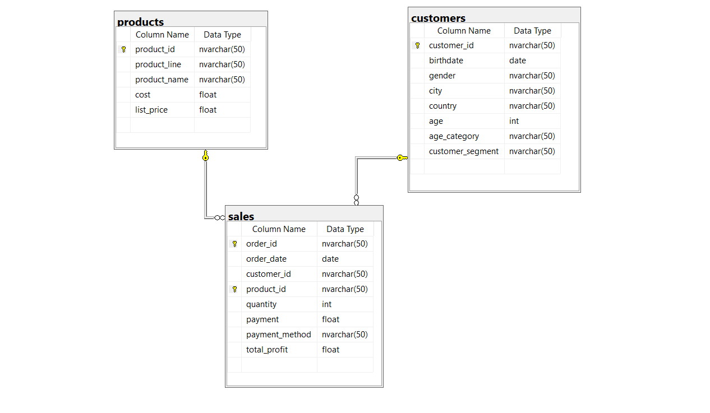
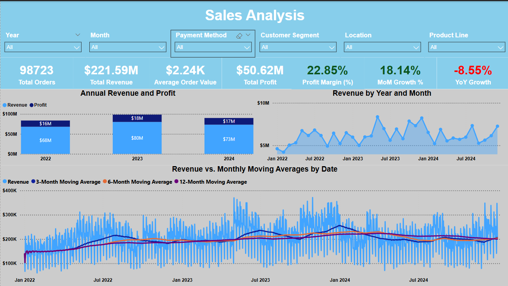

# BritCommerce-Ltd.-Company-Overview

# Project Background
BritCommerce Ltd. is a fictional e-commerce marketplace company based in London, United Kingdom, serving as a comprehensive platform for diverse consumer needs. Between January 2022 and December 2024, the company recorded 98,723 orders from 43,199 unique customers, featuring 30,000 distinct products organized across 15 different product lines with global reach but strongest market presence in the UK. The platform accommodates diverse customer preferences through multiple payment methods including credit cards, debit cards, PayPal, mobile payments, cryptocurrency, and cash on delivery. This dataset contains comprehensive commercial data including customer demographics (age, gender, location, and segments), product specifications (costs, pricing, and profit margins), and detailed transaction information, enabling sophisticated CRM analysis and strategic marketing insights. The analysis examines BritCommerce's three-year performance trajectory to provide critical insights into operational efficiency, market positioning, and growth patterns that will contribute to the company's continued development in the competitive e-commerce landscape.

The report provides evaluations and guidance on the following major topics:

- 👥 **Customer Demographics and Segmentation**: A comprehensive analysis of customer demographics and segments, revealing revenue contributions, spending patterns, and behavioral differences across age groups, genders, and locations.

- 📦 **Product Performance**: An analysis of BritCommerce's product portfolio, focusing on category-level insights such as total products, units sold, revenue, and profit distribution. It highlights the top-selling products, average profit margins across categories, and annual revenue trends, enabling performance benchmarking and strategic product management.

- 📊 **Sales Trends Analysis**: Provides a comprehensive overview of revenue, profit, and order volume patterns over time, highlighting monthly and yearly performance fluctuations along with key growth indicators such as YoY, MoM, profit margin, and payment method preferences.

# 🧩 Schema Description
The SQL code establishes a comprehensive database system for BritCommerceLtd with three interconnected tables, implementing advanced customer segmentation through CTEs and automated profit calculations. The implementation includes robust data validation protocols and enriches the dataset with analytical dimensions such as customer segments, age categories, and profitability metrics to enable sophisticated business intelligence and marketing analytics.

You can access the SQL codes used to accomplish all this [here](BritCommerceLtd.sql).

BritCommerce's database follows a classic e-commerce structure with three core tables: products (storing product details, costs, and pricing), customers (containing demographic and segmentation data), and sales (capturing transaction records). The sales table serves as the central hub, linking products and customers through foreign key relationships while storing essential transaction data including quantities, payments, and calculated profits.

# Executive Summary

## Overview of Findings

BritCommerce demonstrates strong overall performance with 98,723 total orders generating $221.59M in revenue and $50.62M in profit over the three-year period, maintaining a healthy 22.85% profit margin. However, the company faces significant challenges with a declining growth trajectory, showing an 8.55% year-over-year decrease in 2024 despite positive month-over-month growth of 18.14%. Revenue peaked in 2023 ($80.16M) before declining to $73.31M in 2024, indicating the need for strategic intervention to reverse the negative trend and capitalize on positive monthly momentum for sustainable long-term growth.

You can see one of the related pages from dashboard. In order to download the full interactive dashboard click [here](BritCommerceLtd_dashboard.pbix).

# Customer Demographics and Segmentation

* **Gender Distribution:** The customer base shows a female preference with 55% female customers (23,760) compared to 45% male customers (19,439), indicating strong appeal to female demographics while maintaining substantial male market penetration.

* **Age Demographics:** Well-distributed age profile with 35-96% representing the largest segment (15.54K customers), followed by 18-25 age group (10.38K customers), demonstrating broad generational appeal across BritCommerce's platform.

* **Geographic Market Performance:** Strong UK dominance with significant European presence in France, Germany, Italy, and Turkey, showcasing successful international expansion beyond the domestic market.

* **Customer Segmentation Success:** Value Seekers lead with 11,798 customers, followed by High Spenders (10,138) and Loyal customers (6,488), indicating effective segmentation strategy with clear customer lifecycle progression.

* **Revenue by Segment:** High Spenders generate the highest revenue ($97.42M) despite being second in volume, followed by Loyal customers ($33.54M), demonstrating successful premium customer cultivation and monetization.

* **Top Customer Profile:** CUST21904, a 33-year-old female with $34.93K spend across 12 orders and 96 products, exemplifies high-value customer potential with $7.88K profit contribution.

* **Gender-Based Revenue Patterns:** Male customers contribute higher spending in premium segments while female customers show consistent engagement across all tiers, requiring tailored marketing approaches for different demographic behaviors.

# Product Performance

* **Product Portfolio Scale:** BritCommerce maintains an extensive catalog of 30,000 products across 18 categories, demonstrating comprehensive market coverage and diverse product offering to meet varied customer needs.

* **Category Performance Leaders:** Toys dominate sales performance with the highest revenue ($45.53M), followed by Home&Kitchen ($37.98M) and Health&Fitness ($24.53M), indicating strong consumer demand in lifestyle and entertainment categories.

* **Profit Margin and Product Distribution:** Gaming leads profitability with 30.19% average profit percentage despite having fewer products, while Toys maintains the largest product count with competitive 29.65% profit percentage. Categories like Electronics and Automotive show strong product variety with consistent profit percentage around 29-30%, demonstrating effective pricing strategies across diverse product portfolios.

* **Top Product Success:** Product_6028_WEWBO (Automotive category) leads individual product performance with 244 units sold, generating $16.38K revenue and $2.65K profit at 19.32% profit margin, showcasing strong performance in the automotive segment.

* **Best Seller Diversity:** Top 10 products span multiple categories including Automotive, Toys, Electronics, Home&Kitchen, Music, and Health&Fitness, indicating balanced demand across different product segments rather than concentration in single categories.

* **Units Sold Distribution:** Toys, Gardening, Electronics, and Automotive stand out as the highest volume categories, while Home&Kitchen and Health&Fitness maintain a strong presence, reflecting diverse customer purchasing patterns.

* **Revenue Growth Patterns:** Annual revenue by category shows Toys maintaining consistent leadership across 2022-2024, while categories like Gardening and Electronics demonstrate steady performance, indicating stable market positioning and customer loyalty.

# Sales Trends

* **Overall Performance Metrics:** BritCommerce achieved strong overall results with 98,723 total orders generating $221.59M in revenue and $50.62M in profit, maintaining a healthy 22.85% profit margin with an average order value of $2.24K across the three-year period.

* **Annual Growth Trajectory:** Revenue peaked in 2023 at $80.16M before declining to $73.31M in 2024, while profit followed a similar pattern from $18.31M (2023) to $16.75M (2024), indicating challenges in sustaining growth momentum despite initial strong performance from 2022's $68.12M revenue baseline.

* **Monthly Seasonality Patterns:** Monthly revenue shows distinct seasonal trends with December leading at $22M followed by strong performance in May ($21M), October ($20M), and August ($20M), while February shows the lowest performance at $14M. Profit margins remain consistent with December generating the highest profit at $5.0M and February the lowest at $3.3M, indicating strong year-end shopping behaviors and winter seasonal variations.

* **Weekly Order Distribution:** Tuesday emerges as the peak sales day with 18.9K orders, followed by Monday (17.5K) and Wednesday (13.8K), while weekends show lower activity (Saturday: 12.5K, Sunday: 7.5K), indicating B2B or weekday-focused customer behavior patterns.

* **Payment Method Analysis:** Credit cards dominate with 39,440 orders ($88.5M revenue), followed by mobile payments (9,823 orders, $22.0M) and PayPal (9,848 orders, $22.1M), while emerging payment methods like cryptocurrency show growing adoption with 5,026 orders generating $11.3M revenue.

* **Current Growth Challenges:** Despite positive month-over-month growth of 18.14%, the company faces significant year-over-year decline of -8.55%, with detailed monthly data showing consistent downward trends in 2024 across orders, revenue, and profit metrics compared to 2023 performance.

* **Revenue Forecasting and Trends:** The 12-month revenue forecast suggests continued volatility with potential recovery into 2025, while moving averages indicate revenue stabilization around $200K monthly levels, suggesting the need for strategic interventions to reverse the declining trend and capitalize on seasonal opportunities.

# Key Insights

## Financial Performance

**Revenue Trajectory Concerns:** BritCommerce achieved peak performance in 2023 with $80M revenue (+17.67% YoY), but experienced significant decline in 2024 to $73M (-8.55%), indicating potential market challenges or competitive pressures requiring immediate attention.

**Seasonal Revenue Volatility:** The company exhibits extreme seasonal fluctuations with May and December representing peak months ($26.8M-$27M) while February consistently underperforms ($17.7M), creating predictable cash flow challenges throughout the year.

**Profit Margin Stability:** Despite revenue volatility, BritCommerce maintains consistent profit margins around 22-24%, demonstrating operational efficiency and effective cost management across all business cycles.

## Product Portfolio Performance

**Volume vs. Profitability Disconnect:** The best-selling product (Product_6028_WEWBO) generates only 19.32% profit margin compared to the company average of 29.58%, highlighting a critical misalignment between popular products and profitable ones.

**Category Concentration Risk:** BritCommerce shows heavy dependence on Toys and Home&Kitchen categories for revenue generation. The 2024 decline in these dominant categories highlights the risk of over-reliance on specific product lines, despite consistent profitability margins across the portfolio.

**Product Line Diversification:** With 30,000 products across 15 categories, BritCommerce has achieved portfolio breadth, but the narrow profit margin range (22.28%-23.55%) suggests limited pricing differentiation strategies.

## Customer Demographics and Behavior

**Young Demographic Dominance:** Nearly 60% of customers fall within 18-35 age groups (35.95% aged 26-35, 24.04% aged 18-25), indicating strong digital-native market penetration but potential vulnerability to demographic shifts.

**High-Value Customer Concentration:** High Spenders generate $97.42M (44% of total revenue) despite representing only 14.84% of customers, creating significant revenue dependency on a small customer segment.

**Geographic Market Concentration:** Strong UK and German market presence with European diversification, but limited penetration in Nordic and Eastern European markets represents untapped growth opportunities.

## Operational Patterns

**Weekly Order Distribution:** Monday emerges as peak ordering day (19,000 orders) with mid-week strength, while weekends show significant drop-offs, indicating B2B or work-related purchasing patterns.

**Payment Method Diversification:** Credit cards dominate (39.9% of orders, $88.5M revenue) but consistent average order values across all payment methods ($2,221-$2,256) suggest effective payment strategy implementation.

**Gender-Based Spending Patterns:** Female customers consistently outspend males across segments, particularly among High Spenders, indicating potential for targeted gender-based marketing strategies.

# Recommendations

## Revenue Growth and Stability

**Implement Counter-Seasonal Strategies:** Develop targeted promotional campaigns and product launches during historically weak months (February, September) to smooth revenue volatility and improve cash flow predictability.

**Diversify Revenue Streams:** Reduce dependency on Toys and Home&Kitchen categories by strategically expanding high-margin segments like Gaming, Books, and Snacks & Chocolates that show superior profitability rates.

**Geographic Expansion Initiative:** Prioritize market development in Nordic and Eastern European countries where current customer presence is limited but market potential exists based on demographic and economic indicators.

## Product Portfolio Optimization

**Repricing Strategy for Volume Leaders:** Conduct comprehensive pricing analysis for high-volume, low-margin products like Product_6028_WEWBO to improve profitability without significantly impacting sales volume.

**Product Line Rationalization:** Evaluate underperforming products within the 30,000-product portfolio and consider discontinuing items that fail to meet minimum profitability thresholds to optimize operational efficiency.

## Customer Segmentation and Retention

**Champions Segment Development:** Implement loyalty programs and exclusive offerings to convert High Spenders and Loyal customers into Champions, as this segment represents only 1.52% of the customer base despite high potential value.

**Age Demographic Expansion:** Develop targeted marketing campaigns for 45+ age groups who currently represent smaller customer segments but may have higher disposable income and loyalty potential.

**Value Seeker Monetization:** Create tiered pricing strategies and value-added services for the 25.7% Value Seeker segment to increase their average order value without losing price sensitivity appeal.

## Operational Efficiency Improvements

**Weekend Sales Optimization:** Develop weekend-specific marketing campaigns and promotions to capitalize on the significant drop in Saturday orders and boost overall weekly performance.

**Payment Method Optimization:** Promote adoption of lower-cost digital payment methods while maintaining the current successful multi-payment approach that ensures consistent order values across all channels.

**Female Customer Focus:** Leverage the identified gender spending patterns by developing female-targeted marketing campaigns and product recommendations, particularly for high-margin categories.

## Strategic Performance Monitoring

**Monthly Performance Dashboards:** Implement real-time monitoring systems for the identified seasonal patterns to enable proactive management of inventory, marketing spend, and cash flow during predictable 
fluctuation periods.

**Margin Monitoring by Category:** Establish automated alerts for profit margin changes by product line to quickly identify and address pricing or cost issues before they impact overall profitability.

**Customer Lifetime Value Tracking:** Develop sophisticated analytics to track customer migration between segments and identify early warning signs of High Spender attrition to protect revenue concentration risks.

